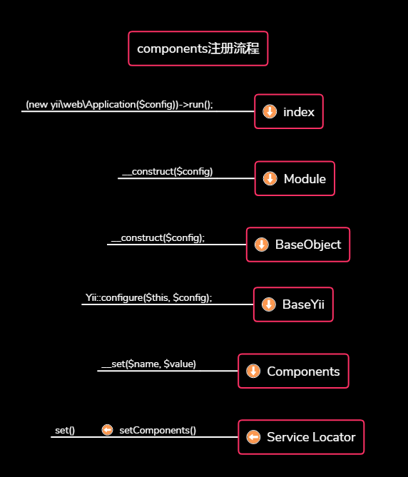

## Service Locator

[参考文档]: http://www.digpage.com/service_locator.html

### 1.介绍

​	服务定位器，用于**解耦**，是IOC的一中实现方式。

​	核心：把所有可能用到的依赖单元交由Service Locator进行实例化和创建、配置。把类对单元的依赖转化为类对Service Locator的依赖。

### 2.优点

- 充当一个运行时的链接器的角色，可以在运行时动态地修改一个类所要选用的服务，而不必对类做任何的修改。
- 一个类可以在运行时，有针对性地增减、替换所要用到的服务。
- 实现服务提供方、服务使用方完全的解耦。


### 3.Service Locator的数据结构

- $_components

  作用：缓存组件/服务的实例	

- $_definitions        

  作用：缓存组件/服务的定义

  定义格式：

  - 类名

    ```php
    'yii/db/Connection'
    ```

  - 数组

    ```php
    'db' => [ 
        'class' => 'yii/db/Connection'
        ...
    ];
    ```

  - 匿名函数   

    ```php
    function () {
        return new yii/db/Connection;
    }
    ```

  - 实例

    ```php
    new yii/db/Connection;
    ```

    

### 4.服务、组件的注册

​	向Service Locator中注册服务或组件，其实就是向 **$_definitions** 数组写入信息。

​	注册方法：

```php
public function set($id, $definition)
{
    unset($this->_components[$id]);

    if ($definition === null) {
        unset($this->_definitions[$id]);
        return;
    }

    if (is_object($definition) || is_callable($definition, true)) {
        // an object, a class name, or a PHP callable
        $this->_definitions[$id] = $definition;
    } elseif (is_array($definition)) {
        // a configuration array
        if (isset($definition['class'])) {
            $this->_definitions[$id] = $definition;
        } else {
            throw new InvalidConfigException("The configuration for the \"$id\" component must contain a \"class\" element.");
        }
    } else {
        throw new InvalidConfigException("Unexpected configuration type for the \"$id\" component: " . gettype($definition));
    }
}
```

​	批量注册：

```php
public function setComponents($components)
{
    foreach ($components as $id => $component) {
 	   $this->set($id, $component);
	}
 }
```


### 5.服务、组件的调用

​	通过注册组件/服务的 **$id** 来获取组件/服务的**实例**。

```php
public function get($id, $throwException = true)
{
    if (isset($this->_components[$id])) {
    	return $this->_components[$id];
    }

    if (isset($this->_definitions[$id])) {
        $definition = $this->_definitions[$id];
        if (is_object($definition) && !$definition instanceof Closure) {
            return $this->_components[$id] = $definition;
        }

    	return $this->_components[$id] = Yii::createObject($definition);
    } elseif ($throwException) {
    	throw new InvalidConfigException("Unknown component ID: $id");
    }

    return null;
}
```


### 6.通过属性的方式进行访问

​	通过getter方法像访问属性一样访问这些服务、组件。前提是必须要先注册。

```php
eg:Yii::$app->request；
    
       
public function __get($name)
{
    if ($this->has($name)) {
        return $this->get($name);
    }

    return parent::__get($name);
}
```


### 7.components注册流程

​	

